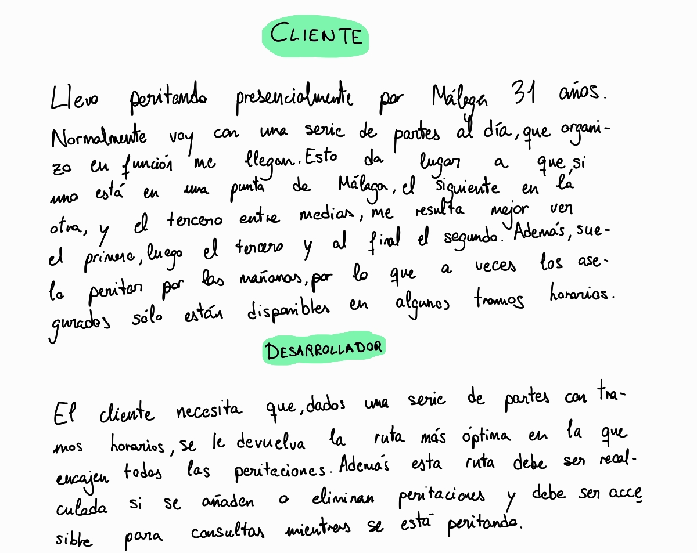
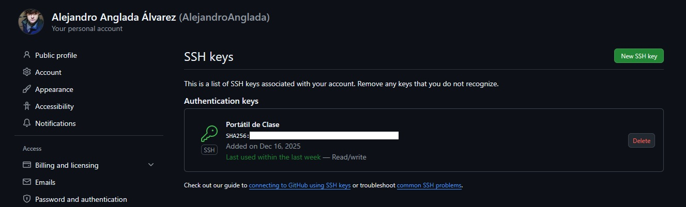

## Tarjetas del juego de rol Cliente - Desarrollador

He decidido pasar a limpio en mi tablet ambas tarjetas.

## Justificación de despliegue en la nube

Se justifica un despliegue en la nube por el cálculo constante de la heurística para ordenar las peritaciones por prioridad. Hacer esto es costoso, no vale con un simple algoritmo de ordenación, y con un despliegue en la nube el sistema es escalable si la demanda computacional se vuelve elevada al haber un gran número de peritaciones entrantes (por ejemplo, por lluvias constantes o desastres meteorológicos, como pasó con la DANA de Valencia).

Además, con un despliegue en la nube el usuario es capaz de enviar la tabla desde la oficina y consultarla cuando esté peritando desde cualquier dispositivo.

Por último, a pesar de que puede darse que el usuario no acceda a la tabla en un periodo de tiempo, el sistema debe ser capaz de recalcular las prioridades de forma periódica, pues si el tiempo transcurre la heurística proporciona prioridades diferentes.

## Datos del problema

Se posee como datos del problema la tabla con las peritaciones entrantes.

## Configuración del repositorio

* Licencia: GNU General Public License, versión 3.
* Control de versiones: Uso de git (mediante clave SSH censurada, véase captura abajo) aplicado a cualidades de desarrollo ágil (creación de ramas, issues, milestones, pipelines CI/CD, etc).

